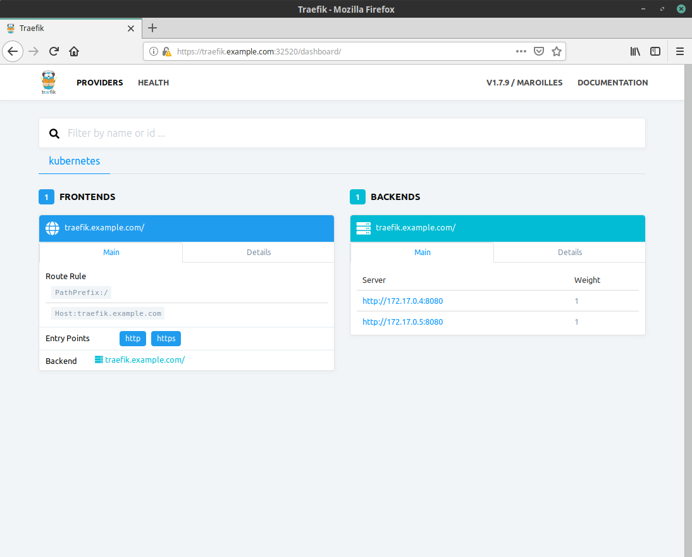

# kubernetes-traefik
Traefik has this feature in versions 1.7 and newer

## Prerequirements

Create TLS certificate that we'll use for UI:
```
openssl req -x509 -nodes -days 3650 -newkey rsa:2048 -keyout ./tls.key -out ./tls.crt -subj "/CN=traefik.example.com"
```

After certificates are created, put them in secret that is described in `tls_secret.yaml`.

Please note that `tls.crt` field must have value that you get after execute command:
```
cat tls.crt | base64 -w0
```
Repeat the same command for `tls.key` field:
```
cat tls.key | base64 -w0
```
Note that example certificates are matching `traefik.example.com` CN.

## Ship it

- Create namespace:
```
kubectl create namespace traefik
```

- Modify `entryPoints.traefik.auth.basic` section of `deployment.yaml` with new admin username/password
```
htpasswd -nb admin new_password_you_choose
```

- Apply deployment file and service account file:
```
kubectl apply -f ./
```


## Recap

We need this k8s components:
- namespace
- service account
- TLS secret
- cluster role and cluster role binding
- configmap
- deployment
- service for http and https
- service for Traefik dashboard
- an ingress

All componentes are described in `*.yaml` files.

### ConfigMap

```
---
apiVersion: v1
kind: ConfigMap
metadata:
  name: traefik-configmap
  namespace: traefik
data:
  traefik.toml: |
    defaultEntryPoints = ["http","https"]

    [entryPoints]

      [entryPoints.http]
      address = ":80"


      [entryPoints.https]
      address = ":443"
        [entryPoints.https.tls]
          [[entryPoints.https.tls.certificates]]
          CertFile = "/ssl/tls.crt"
          KeyFile = "/ssl/tls.key"

      [entryPoints.traefik]
        address = ":8080"
        [entryPoints.traefik.auth.basic]
        users = ["admin:$apr1$zjjGWKW4$W2JIcu4m26WzOzzESDF0W/"]

    [kubernetes]
      [kubernetes.ingressEndpoint]
        publishedService = "traefik/traefik"

    [ping]
    entryPoint = "http"

    [api]
    entryPoint = "traefik"
```
We have three default entry points, `http`,`https` and `traefik`. First and second are listening on ports `80` and `443` and they're self-explanatory. Third one is used for `Traefik UI Dashboard`. We want to have UI secured with Basic Auth + TLS certificates.
It's very important to have `publishedService = "traefik/traefik-ingress-controller-http-service"` set. value `traefik/traefik-ingress-controller-http-service` has format `namespace/service name`. If you plan to change the name of the namespace and service, you have to change this values to values that matches to your environment.

### Service
First service we need here is `traefik-ingress-controller-http-service`. It will expose `http` and `https` entry points defined in `ConfigMap` to the `LoadBalancer`. If you check LoadBalancer Security Group (ingress), ports 80 and 443 are opened. K8S will automatically create a LoadBalancer and join a node(s) that is/are running Traefik pods. If you want to create internal ELB as I did, you have to define annotations.

### Service for UI Dashboard
This is the cool part! I wanted to have Dashboard under https since it requires basic authentication. The Dashboard is running on port `:8080` and we need to redirect it to use SSL. Service is very simple and real magic will happen in the Ingress object.

### Ingress for UI Dashboard
The magic part of a proxying secured Traefik Dashboard through Traefik itself is defined in Ingress object. Controlling Traefik ingress is possible by using *Traefik annotations*

```
---
apiVersion: extensions/v1beta1
kind: Ingress
metadata:
  name: traefik-ingress-controller-dashboard-ingress
  namespace: traefik
  annotations:
    kubernetes.io/ingress.class: traefik
    traefik.ingress.kubernetes.io/frontend-entry-points: http,https
    traefik.ingress.kubernetes.io/redirect-entry-point: https
    traefik.ingress.kubernetes.io/redirect-permanent: "true"
spec:
  rules:
  - host: traefik.example.com
    http:
      paths:
      - path: /
        backend:
          serviceName: traefik-ingress-controller-dashboard-service
          servicePort: 8080
```

We need 4 annotations and they are all self-explanatory. Of course, to get it fully working you have to create DNS record `traefik.example.com` that will point your ELB.


## Minikube

If you want to run this example with `minikube`, edit `traefik-ingress-controller-http-service`, change `type` from `LoadBalancer` to `NodePort`.

Edit `/etc/hosts` and add record `minkube_ip_address` `traefik.example.com`.
Note: Default minikube IP address is `192.168.99.100`.


You can inspect which port is assigned by executing:

```$ kubectl get svc -n traefik
NAME                                             TYPE        CLUSTER-IP       EXTERNAL-IP      PORT(S)                      AGE
traefik-ingress-controller-dashboard-service   ClusterIP   10.96.120.63         <none>         8080/TCP                     2m23s
traefik-ingress-controller-http-service        NodePort    10.108.120.206       <none>         80:30530/TCP,443:32520/TCP   2m23s
```

Go to your browser and open (in this case): `https://traefik.example.com:32520`, authenticate with `admin`/`admin`.

